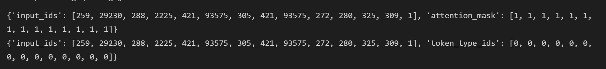

# MT5_paddle
Use PaddlePaddle to reproduce the paper：mT5: A Massively Multilingual Pre-trained Text-to-Text Transformer

English | [简体中文](./README_cn.md)


[mT5: A Massively Multilingual Pre-trained Text-to-Text Transformer](https://arxiv.org/abs/2010.11934)


**Abstract：**
The recent “Text-to-Text Transfer Transformer” (T5) leveraged a unified text-to-text format and scale to attain state-of-the-art results on a wide variety of English-language NLP tasks. In this paper, we introduce mT5, a multilingual variant of T5 that was pre-trained on a new Common Crawl-based dataset covering 101 languages. We detail the design and modified training of mT5 and demonstrate its state-of-the-art performance on many multilingual benchmarks. We also describe a simple technique to prevent “accidental translation” in the zero-shot setting, where a generative model chooses to (partially) translate its prediction into the wrong language. All of the code and model checkpoints used in this work are publicly available.

This project is an open source implementation of MT5 on Paddle 2.x.


## Environment Installation

| label  | value              |
| ------ | ------------------ |
| python | >=3.6              |
| GPU    | V100               |
| Frame  | PaddlePaddle2\.1.2 |
| Cuda   | 10.1               |
| Cudnn  | 7.6                |

Cloud platform used in this recurrence：https://aistudio.baidu.com/


```bash
# Clone the repository
git clone https://github.com/27182812/MT5_paddle
# Enter the root directory
cd MT5_paddle
# Install the necessary python libraries locally
pip install -r requirements.txt

```

"test.ipynb" has run results display.

## Quick Start

### （一）Tokenizer Accuracy Alignment

```
### 对齐tokenizer
text = "Welcome to use paddle and paddlenlp!"
torch_tokenizer = PTT5Tokenizer.from_pretrained("./mt5-large")
paddle_tokenizer = PDT5Tokenizer.from_pretrained("./mt5-large")
torch_inputs = torch_tokenizer(text)
paddle_inputs = paddle_tokenizer(text)
print(torch_inputs)
print(paddle_inputs)

```



### （二）Model Accuracy Alignment

run `python compare.py`，Comparing the accuracy between huggingface and paddle.
```python
python compare.py
# MT5-large-pytorch vs paddle MT5-large-paddle
mean difference: tensor(2.0390e-06)
max difference: tensor(0.0004)


```


### (三）Weights Transform

run `python convert.py`，transform weights of huggingface model to weights of paddle model. The weight path needs to be replaced


### (四）Downstream task fine-tuning

run `python train.py`.  "args.py" is for parameter.


#### 

# Reference
大佬的T5代码：https://github.com/JunnYu/paddle_t5

```bibtex
@unknown{unknown,
author = {Xue, Linting and Constant, Noah and Roberts, Adam and Kale, Mihir and Al-Rfou, Rami and Siddhant, Aditya and Barua, Aditya and Raffel, Colin},
year = {2020},
month = {10},
pages = {},
title = {mT5: A massively multilingual pre-trained text-to-text transformer}
}
```
