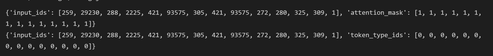
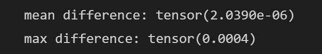

# MT5_paddle
使用PaddlePaddle复现论文：mT5: A Massively Multilingual Pre-trained Text-to-Text Transformer

[English](./README.md) | 简体中文


[mT5: A Massively Multilingual Pre-trained Text-to-Text Transformer](https://arxiv.org/abs/2010.11934)


**摘要**
最近的 “Text-to-Text Transfer Transformer”（T5）利用统一的文本到文本格式和比例，在各种英文NLP任务中获得最先进的结果。在本文中，我们介绍了mT5，一个T5的多语言变体，它是在一个新的基于爬虫的数据集上预先训练的，该数据集涵盖101种语言。我们详细介绍了mT5的设计和改进培训，并在许多语言基准上展示了其最先进的性能。我们还描述了一种简单的技术，以防止在zero-shot设置中出现“意外翻译”，即生成模型选择（部分）将其预测翻译成错误的语言。本工作中使用的所有代码和模型检查点都是公开的。

This project is an open source implementation of MT5 on Paddle 2.x.


## 环境安装

| label  | value              |
| ------ | ------------------ |
| python | >=3.6              |
| GPU    | V100               |
| Frame  | PaddlePaddle2\.1.2 |
| Cuda   | 10.1               |
| Cudnn  | 7.6                |

本次复现使用的云平台：https://aistudio.baidu.com/


```bash
# 克隆本仓库
git clone https://github.com/27182812/MT5_paddle
# Enter the root directory
cd 进入根目录
# 本地安装必要的库
pip install -r requirements.txt

```

"test.ipynb"有运行结果展示。


## 快速开始

### （一）Tokenizer 精度对齐

```
### 对齐tokenizer
text = "Welcome to use paddle and paddlenlp!"
torch_tokenizer = PTT5Tokenizer.from_pretrained("./mt5-large")
paddle_tokenizer = PDT5Tokenizer.from_pretrained("./mt5-large")
torch_inputs = torch_tokenizer(text)
paddle_inputs = paddle_tokenizer(text)
print(torch_inputs)
print(paddle_inputs)

```



### （二）模型精度对齐

运行`python compare.py`，比较huggingface和paddle版的模型精度。
```python
python compare.py
# MT5-large-pytorch vs paddle MT5-large-paddle
mean difference: tensor(2.0390e-06)
max difference: tensor(0.0004)


```




### (三）权重转换

运行`python convert.py`，将huggingface的权重转换为paddle的权重。相应的权重路径需要被替换。


### (四）下游任务微调

运行 `python train.py`.  "args.py" 是用来控制参数的。


# Reference

大佬的T5代码：https://github.com/JunnYu/paddle_t5

```bibtex
@unknown{unknown,
author = {Xue, Linting and Constant, Noah and Roberts, Adam and Kale, Mihir and Al-Rfou, Rami and Siddhant, Aditya and Barua, Aditya and Raffel, Colin},
year = {2020},
month = {10},
pages = {},
title = {mT5: A massively multilingual pre-trained text-to-text transformer}
}
```
